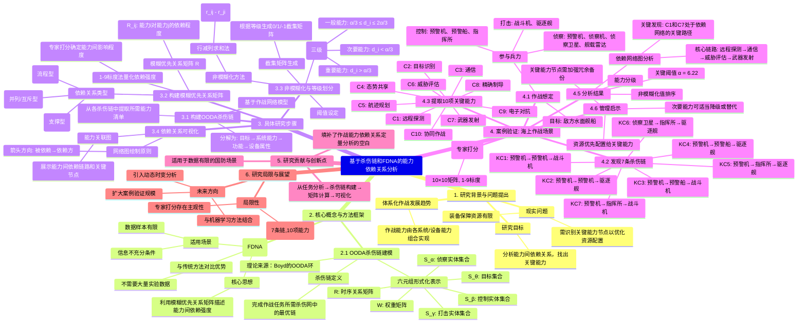

```mermaid
mindmap
  基于杀伤链和FDNA的能力依赖关系分析
    1. 研究背景与问题提出
      体系化作战发展趋势
        作战能力由各系统/设备能力组合实现
      现实问题
        装备保障资源有限
        需识别关键能力节点以优化资源配置
      研究目标
        分析能力间依赖关系，找出关键能力
    2. 核心概念与方法框架
      2.1 OODA杀伤链建模
        理论来源：Boyd的OODA环
        杀伤链定义
          完成作战任务所需杀伤网中的最优链
        六元组形式化表示
          S_α: 侦察实体集合
          S_β: 控制实体集合
          S_γ: 打击实体集合
          S_θ: 目标集合
          R: 时序关系矩阵
          W: 权重矩阵
      2.2 模糊依赖网络分析(FDNA)
        适用场景
          数据样本有限
          信息不充分条件
        核心思想
          利用模糊优先关系矩阵描述能力间依赖强度
        与传统方法对比优势
          不需要大量实验数据
    3. 具体研究步骤
      3.1 构建OODA杀伤链
          分解为: 目标→系统能力→功能→设备属性
          基于作战网络模型
          从各杀伤链中提取所需能力清单
      3.2 构建模糊优先关系矩阵
        依赖关系类型
          输入输出关系(流程型)
          手段目的关系(支撑型)
          属性关系("并列/互斥型")
        1-9标度法量化依赖强度
          专家打分确定能力间影响程度
        模糊优先关系矩阵 R
          R_ij: 能力i对能力j的依赖程度
      3.3 非模糊化与等级划分
        非模糊化方法
          行减列求和法
            d_i = Σ(r_ij - r_ji)
        阈值设定
        能力等级划分(三级)
          重要能力: d_i > α/3
          一般能力: α/3 ≤ d_i ≤ 2α/3
          次要能力: d_i < α/3
        截集矩阵生成
          根据等级生成0/1/-1截集矩阵
      3.4 依赖关系可视化
        网络图绘制原则
          箭头方向: 被依赖→依赖方
        能力关联图
          展示能力间依赖链路和关键节点
    4. 案例验证: 海上作战场景
      4.1 作战想定
        目标: 敌方水面舰船
        参与兵力
          侦察: 预警机、侦察机、侦察卫星、舰载雷达
          控制: 预警机、预警船、指挥所
          打击: 战斗机、驱逐舰
      4.2 发现7条杀伤链
        KC1: 预警机→预警机→战斗机
        KC2: 预警机→预警机→驱逐舰
        KC3: 预警机→预警船→战斗机
        KC4: 预警机→预警船→驱逐舰
        KC5: 预警机→指挥所→驱逐舰
        KC6: 侦察卫星→指挥所→驱逐舰
        KC7: 预警机→指挥所→战斗机
      4.3 提取10项关键能力
        C1: 远程探测
        C2: 目标识别
        C3: 通信
        C4: 态势共享
        C5: 航迹规划
        C6: 威胁评估
        C7: 武器发射
        C8: 精确制导
        C9: 电子对抗
        C10: 协同作战
      4.4 模糊优先关系矩阵(专家打分)
        10×10矩阵, 1-9标度
      4.5 分析结果
        非模糊化值排序
        关键阈值 α = 6.22
        能力分级
        依赖网络图分析
          核心链路: 远程探测→通信→威胁评估→武器发射
          关键发现: C1和C7处于依赖网络的关键路径
      4.6 管理启示
        资源优先配置给关键能力
        关键能力节点需加强冗余备份
        次要能力可适当降级或替代
    5. 研究贡献与创新点
        填补了作战能力依赖关系定量分析的空白
        适用于数据有限的国防场景
        从任务分析→杀伤链构建→矩阵计算→可视化
    6. 研究局限与展望
      局限性
        专家打分存在主观性
        案例规模较小(7条链,10项能力)
      未来方向
        引入动态时变分析
        扩大案例验证规模
        与机器学习方法结合
```